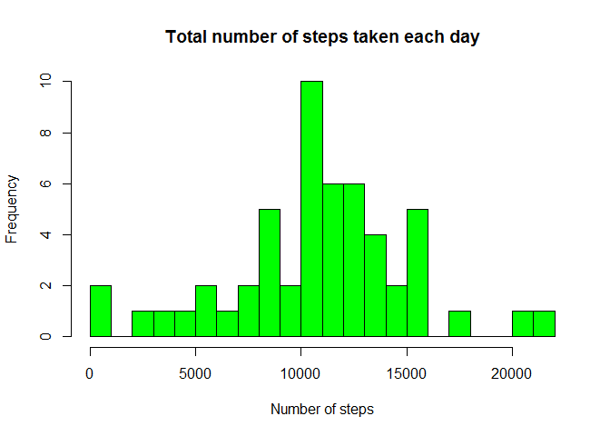
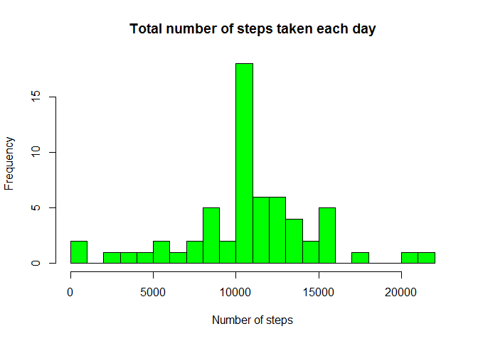
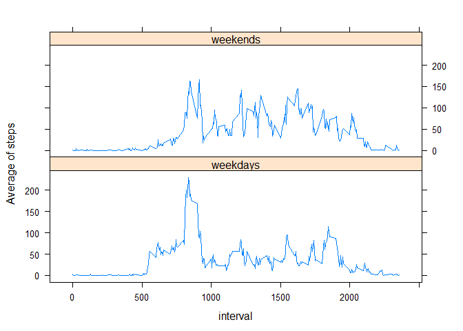

# Reproducible Research: Peer Assessment 1


## Loading and preprocessing the data


```r
activity <- read.table("data/activity.csv", sep=",", header=TRUE)
```


## What is mean total number of steps taken per day?


*1.1: total number of steps per day*

```r
subactivity <-  activity[complete.cases(activity),]
stepbyday <- aggregate(subactivity$steps, by=list(subactivity$date), FUN=sum)
colnames(stepbyday) <- c("date", "sumsteps")
#print(stepbyday)
```


*1.2: Histogram of total number each day*

```r
hist(stepbyday$sumsteps, col = "green", main = "Total number of steps taken each day", xlab="Number of steps", breaks=20)
```

 


*1.3: Mean and Medium of the total number of steps per day*

```r
themean <- mean(stepbyday$sumsteps, na.rm=TRUE)
themedian <- median(stepbyday$sumsteps, na.rm=TRUE)
```

The mean is: **10766.19**

The median is: **10765**


## What is the average daily activity pattern?


*2.1: time series plot*

```r
stepbyinterval <- aggregate(formula=steps~interval, data=subactivity, FUN=mean)
colnames(stepbyinterval) <- c("interval", "averagesteps")
plot(stepbyinterval$interval, stepbyinterval$averagesteps, type="l", xlab="Interval", 
     ylab="Average number of steps") 
```

 


*2.2: interval having the maximum number of steps on average across all the days*

```r
maxstep <- max(stepbyinterval$averagesteps)
datamaxinterval <- subset(stepbyinterval, averagesteps == maxstep)
maxinterval <- datamaxinterval$interval
#print(maxinterval$interval)
```

The maximum number is **206.17** and the interval is **835**

## Imputing missing values


*3.1: total number of rows with NAs*

```r
numberrows <- nrow(activity[!complete.cases(activity),])
```

The number of rows with NAS: **2304**

*3.2: strategy to replace missing value in dataset*

We will use the data frame stepbyinterval who already have the average of steps by interval. 
See next step to create the new dataset


*3.3: new dataset with missing data filled in*

```r
activitymodified <- merge(activity, stepbyinterval, by="interval")
activitymodified$steps.modified <- ifelse(is.na(activitymodified$steps), 
                                          activitymodified$averagesteps, activitymodified$steps)
activitymodified <- activitymodified[order(activitymodified$date, activitymodified$interval),]
```


*3.4: Histogram, mean and median of steps per day with the new dataset*

```r
stepbyday <- aggregate(formula=steps.modified~date, data=activitymodified, FUN=sum)
colnames(stepbyday) <- c("date", "sumsteps")
hist(stepbyday$sumsteps, col = "green", main = "Total number of steps taken each day", xlab="Number of steps", breaks=20)
```

 

```r
mean(stepbyday$sumsteps)
```

```
## [1] 10766.19
```

```r
median(stepbyday$sumsteps)
```

```
## [1] 10766.19
```

The mean is the same, but the median is different. The median is now the same as the mean.


## Are there differences in activity patterns between weekdays and weekends?


*4.1: Create a new factor column indicating weekdays and weekends*

```r
library(lubridate)
activitymodified$weekdays <- ifelse(wday(activitymodified$date)==1 | wday(activitymodified$date) == 7,
                                    "weekends", "weekdays")
activitymodified$weekdays <- factor(activitymodified$weekdays)
#str(activitymodified)
```


*4.2: Create a time series plot of 5 minutes interval by the average number of steps by weekdays or weekends*

```r
library(lattice)
stepbyinterval <- aggregate(formula=steps.modified~interval+weekdays, data=activitymodified, FUN=mean)
xyplot(steps.modified~interval | weekdays, data=stepbyinterval, type = "l", layout = c(1,2),
       ylab="Average of steps")
```

 

